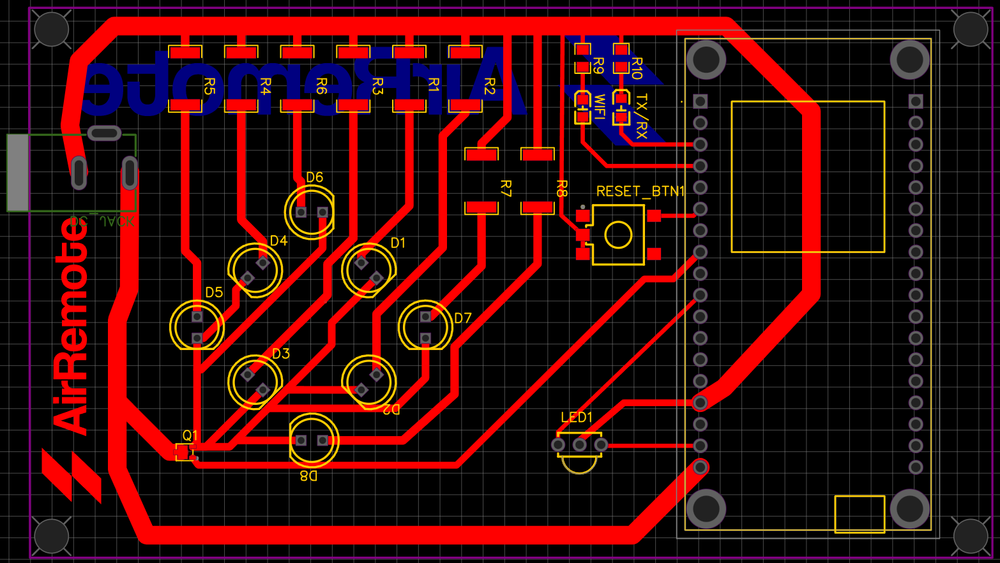

<p align="center">
  
  
</p>

<h2 align="center">AirRemote Embedded Repository ⚡</h2>

Turn your old remote-controlled devices into smart devices! With AirRemote, you can turn any legacy device that can be controlled by an IR remote, into a remotely accesible smart device.


--- 
## 📝  Description


AirRemote is a solution designed to modernize legacy remote-controlled devices by making them smart and remotely accessible. AirRemote operates as a universal remote emulator. It works by capturing the infrared (IR) signals from any remote control—regardless of how rare or obscure—and storing them for later use. The device includes an IR receiver and 8 powerful IR transmitters, enabling it to decode, save and replay the captured IR signals across a room.

## 🔧 Features 
- Record the IR signals by simply pressing the buttons of their existing remote control onto the AirRemote device.
- Replay the stored signals on command via a web interface.
- Create automations to perform a set of operations (such as open lighting, A/C etc.) at specific times.
- Give the device to a friend, with the capability to initialize the device and provide credentials through a Captive Portal interface.
- Manage, Delete, Reorder your favourite devices through the web interface.

With these capabilities, AirRemote turns virtually any device with an IR remote into a smart, remotely controllable appliance.

## 🌟 Project Overview

The **AirRemote** project is divided into three main components. Each part contains instructions on how to deploy / install it:

- [**Embedded Device (This Repository):**](https://github.com/jugeekuz/AirRemote-Embedded) 
    - A C/C++ PlatformIO project, involving ESP32-based unit with an IR receiver and 8 powerful IR blasters. It records IR signals from any remote control and replays them across the room, enabling universal compatibility.
    
- [**Serverless Backend:**](https://github.com/jugeekuz/AirRemote-Backend) 
    - A Python project using Serverless framework to deploy a scalable AWS-based backend powered by Lambda, DynamoDB, API Gateway, and EventBridge. It ensures secure command storage, user authorization, and efficient routing between the web interface and devices.

- [**Frontend:**](https://github.com/jugeekuz/AirRemote-Frontend) 
    - A React JS project providing an application for managing devices, saving IR commands, authenticating users and creating powerful automation routines—all accessible through a sleek web interface.

## 🎥 Demo
Check out the AirRemote in action:

[](https://www.youtube.com/watch?v=example)

---

## ⚙️ Installation and Setup

### 🔨 Creating AirRemote Device

To create the AirRemote board, you can either:
- Create the PCB, through the Gerber file provided and the parts found under `assets/board/`.
- Create your own design, through the EasyEDA json file provided under `assets/board/`.
<div style="text-align:left; margin-left:20px;">
    
</div>
<br/>
You are going to find everything you need to get started under `assets/`. 

### 🛠️ Flashing AirRemote Firmware
To build and upload AirRemote, you will need:
 - [Visual Studio Code](https://code.visualstudio.com/download)
 - [PlatformIO IDE VSCode extension](https://platformio.org/)
 <!-- - [AirRemote device built](#creating-air-remote) -->

To flash the AirRemote firmware onto the device:
 1. Clone this repository: 
    ```bash
    git clone https://github.com/jugeekuz/AirRemote-Embedded.git
    ```
 2. Connect the AirRemote device to your computer.
 3. Click the `PlatformIO: Upload` button to flash the firmware onto the device.

### 🔑 Configure AirRemote Credentials
<div style="text-align:left; margin-left:60px;">
    
</div>

To configure credentials to AirRemote:
 1. Go to your AirRemote web interface -> **Devices** -> **Add Device** -> Name the device and click on `Next`.
 2. Save the credentials shown in a text file (as you'll need to input them to the device) and click on `Finish`.
 3. Connect your AirRemote device to power and click on the Reset button.
 4. When the light starts blinking slowly, open a mobile device and connect to the `AirRemote-Portal` WiFi.
 5. A captive portal, as shown below, should open (if not, go to a browser and hit `4.3.2.1` or `captive.apple.com` on iOS devices).
 6. Click on **Complete Setup**, if setting up for the first time.
 7. Follow the instructions to connect to WiFi and then provide the credentials saved in Step 2.
Your device is ready to use!
If there is an error during configuration, restart the device and follow the same process again.

---

## 📜 License
Licensed under the MIT License.
🔗 View License Details 

---

## 🤝 Contributing
Feel free to fork the repository and contribute! Pull requests and feedback are welcome.

